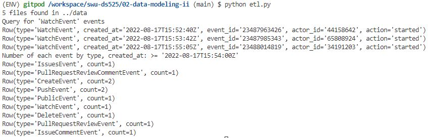

# Data Modeling II

## Getting Started

```sh
python -m venv ENV
source ENV/bin/activate
pip install -r requirements.txt
```

## Running Cassandra

```sh
docker-compose up
```

## Running ETL Script
```sh
python etl.py
```

## To shutdown, press Ctrl+C and run:

```sh
docker-compose down
```

## Example query from cassandra keyspace

