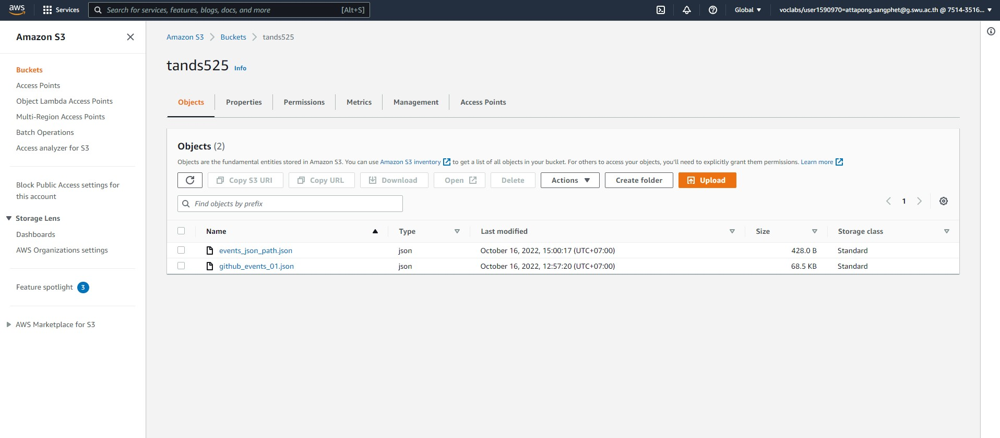
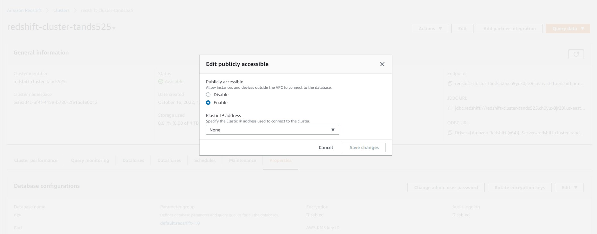
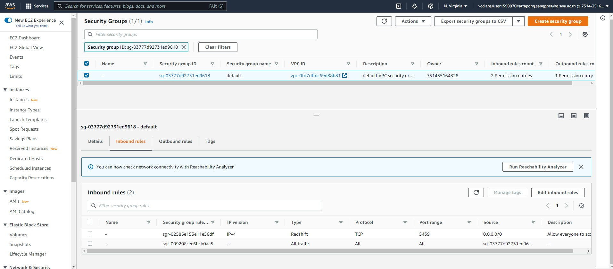
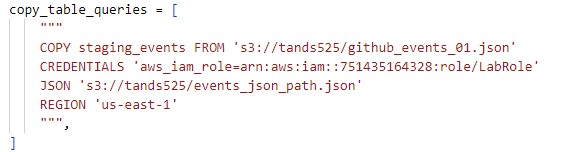
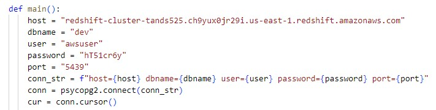
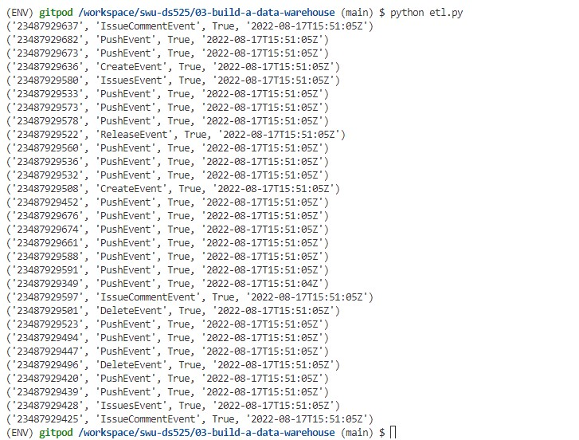
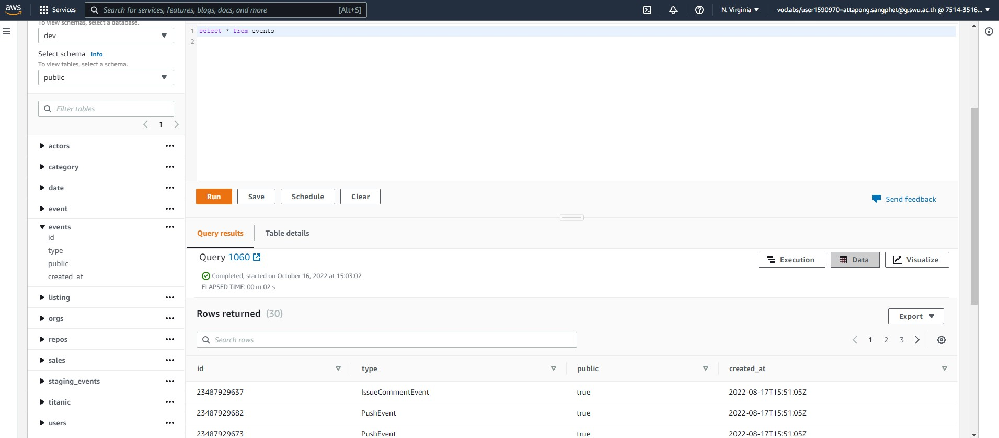

# Data Modeling II - Building a Data Warehouse

## First, We create AWS S3 as our datalake that we can store our JSON files, Events data and JSON Path.
### Create AWS S3


## Then, We create AWS Redshift, an AWS data warehouse, for loading data from S3 into it.

### Create AWS Redshift


### enable publicly asccessible of AWS Redshift


### Configure inbound rules of IAM to make sure that we are allowed to access to AWS Redshift, specific soreces an types is recommended.


### Change paths of AWS S3, AWS Redshift and IAM roles to the correct paths that we need to connect before running ETL Script.
### S3 Connection path

### Redshift Connection path


## Now we can access to AWS Redshift by running provided etl scripts of query commands.

### Getting Started
```sh
python -m venv ENV
source ENV/bin/activate
pip install -r requirements.txt
```

### Running ETL Script
```sh
python etl.py
```

## Data Model


## Some examples of data query are shown in pictures below
### Events table

### Events table (by Query Editor in AWS Redshift)



