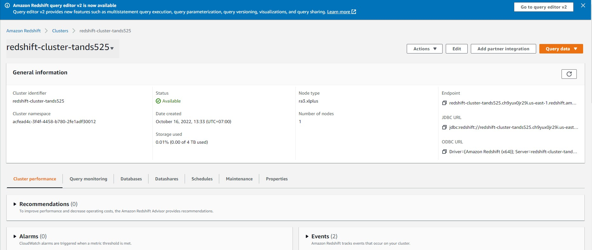

# Data Modeling II - Building a Data Warehouse

### Create AWS Redshift 

## AWS Redshift


## Getting Started
```sh
python -m venv ENV
source ENV/bin/activate
pip install -r requirements.txt
```

## Running ETL Script
```sh
python etl.py
```


