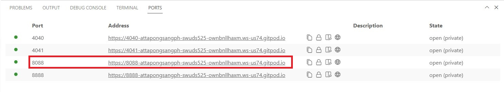
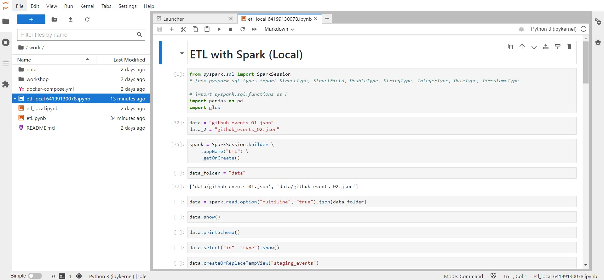
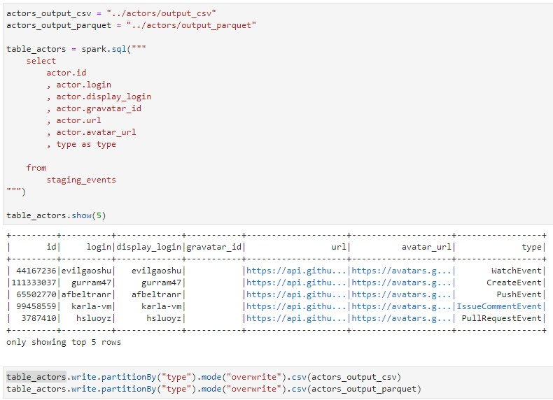
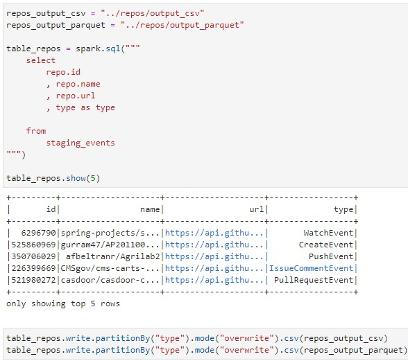
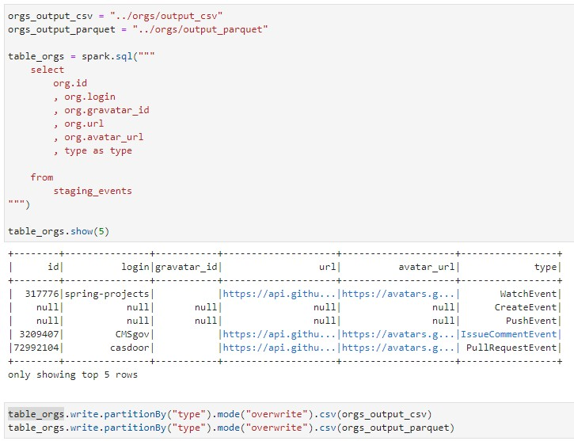
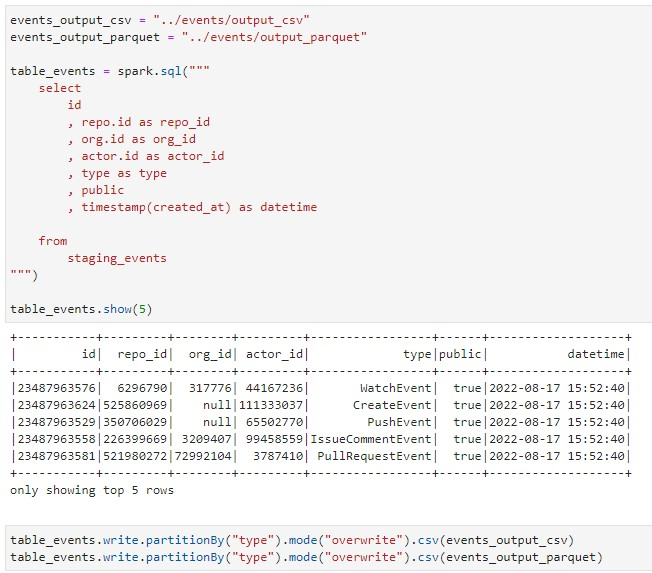

# Building a Data Lake

## getting start
## running pyspark-notebook (On Gitpod)

```sh
docker-compose up
```

## Then we can follow url address of port 8888 for running ETL scipts on pyspark-notebook





## running ETL scripts to create new data tables from JSON files






## we can save created tables to CSV or parquet file as  shown in the picture below


## or transfrom your data to any table you want


