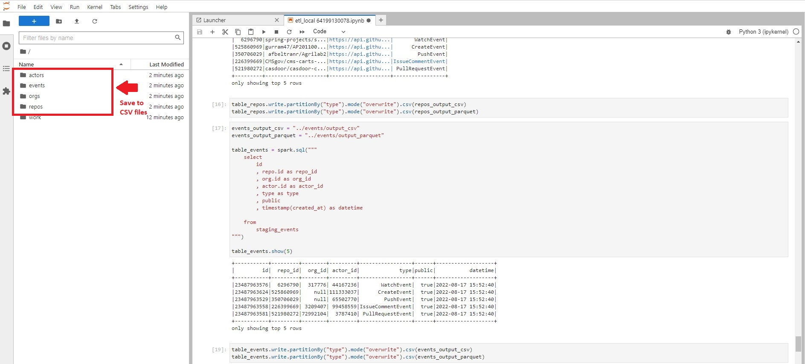
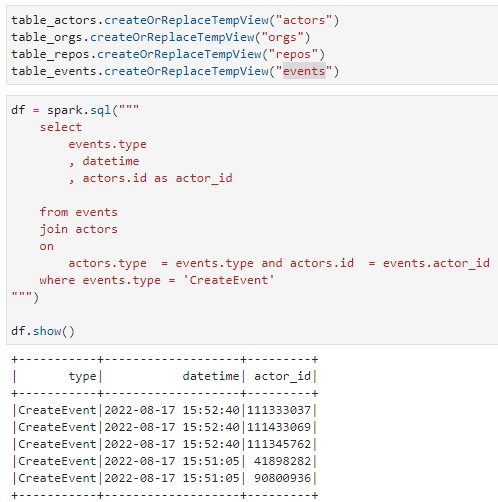

# Building a Data Lake

## getting start

### change to directory of your prepared scripts

```sh
cd 04-build-a-data-lake/
```

### running docker-compose of pyspark-notebook service (On Gitpod)

```sh
docker-compose up
```

### Then we can follow url address of port 8888 for running ETL scipts on pyspark-notebook


### running ETL scripts to create new data tables from JSON files


### we can save created tables to CSV or parquet file as  shown in the picture below



### or transfrom your data to any table you want


