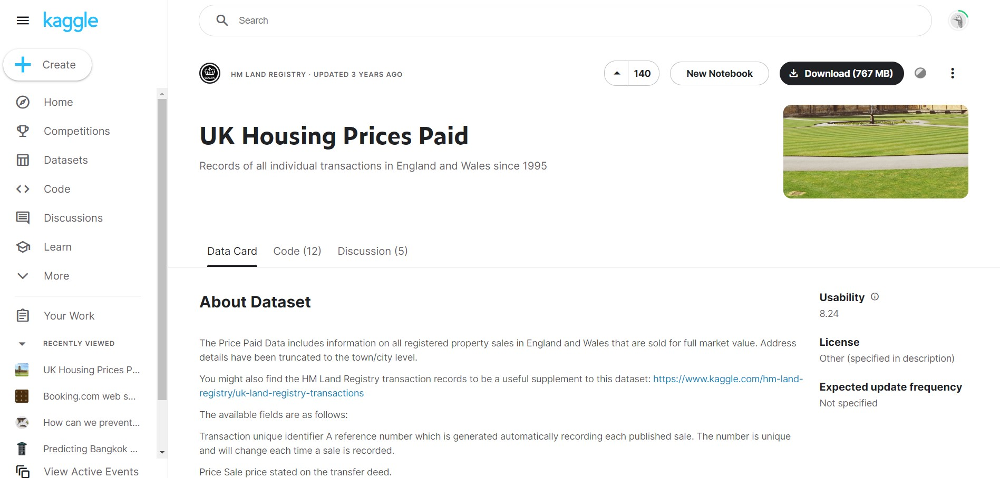
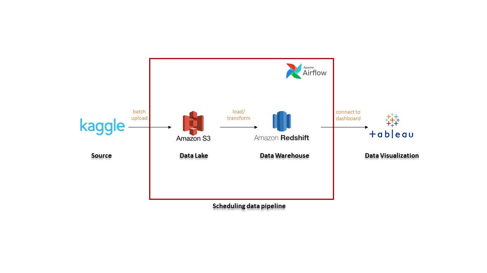

# Capstone Project Construction

## problem
For anyone who want to purchase properties in UK or Real Estate Company which is looking for investing in properties in UK, The housing price paid information is one of the most important thing they should know before spending their money for it, especially the detached house which is has a very high price compared to another property type. Thus, in this project, I am interested to study about information of detached houseing price in UK and create data platform for building dashboard to present actual information about housing price paid or to find insight of them. 


## Source

Raw data that I chose for this project is the information of all registered property sales in United Kingdom from Kaggle website. It is available to download [here](https://www.kaggle.com/datasets/hm-land-registry/uk-housing-prices-paid).




## Data Modeling
The designed data modeling is non-relational data base that comprises four tables, stagging table, "conut by type" table, "average price of detached house by district" table and "price of detached house" table. The last three tables are builded by tranforming selected data from stagging table and are collected in columnar type database with partisioning. By building data model like this, new created tables are more comfortable to be used for visualization than using all data in table includes unwanted data. Users can get only useful data that we need to provide to them and they can query data faster. The details of data modeling are shown in picture below.


## Data Ingestion
This preovided data pipeline start from collecting the data from Kaggle website then uploading raw data to AWS S3 by using etl code. After preparing raw data in AWS S3 bucket, the next step are creating tables, loading raw data from AWS S3 bucket to AWS Redshift and transfroming stagging data to new tables in AWS Redshift by using Airflow for scheduling task, in this project is set for weekly schedule. And the last step is connecting AWS Redshift to Tableau Desktop and buildin Dashboard for data visualization. The data pipeline's workflow is slown in picture below




## Tools & Technologies
Computer language: Python, SQL, Spark
Tools: AWS S3, AWS Redshift, Airflow, Tableau, Gitpod platform


## Getting Start

### create and activate virtual environment and install tools as provided in requirements file.

```sh
python -m venv ENV
source ENV/bin/activate
pip install -r requirements.txt
```

### make dags directory in Airflow

```sh
mkdir -p ./dags ./logs ./plugins
echo -e "AIRFLOW_UID=$(id -u)" > .env
```

### Run docker-compose 

```sh
docker-compose up
```

### After running prepared docker-compose file, we can access to PySpark and Airflow by following port 8080 and port 8888 respectively.

## Create Data lake, AWS S3 Bucket

First of all, we need to create the AWS S3 bucket as our "data lake" to collect raw data. AWS S3 is great one of cloud storage that can collect data in the large scale as we want and charge the cost per size of data storing. However, AWS S3 cost is still very cheap compared to another platform.

In this step, S3 bucket must be edited "block public access" and bucket policy to allow all access from public can connect to the bucket (note: this edition is not recemmended for practical use).

To get AWS Credential keys for connecting to S3 bucket, we can use code below on the AWS interface as shown in picture to get "aws_access_key", "aws_secret_access_key", "aws_session_token"

```sh
cat ~/.aws/credentials
```


And we can find AWS S3 URI in the S3 properties interface as shown in picture below


## Loading raw data to Datalake, AWS S3 bucket
To connect to AWS S3 bucket, AWS Credential keys as mentioned above and S3 URI are required in this step. 
Change connection configurations in etl code following by AWS Credential keys and S3 URI.


### run provided etl code to load raw data to AWS s3 Bucket.

```sh
python etl_load_data_to_s3.py
```

Now, our data was uploaded to S3 bucket


## Create Data Warehouse, AWS Redshift
AWS Redshift will be used as data warehouse for tranfroming raw data from data lake, AWS S3, to another tables that we need in AWS Redshift. Because of AWS Redshift is based on PostgreSQL that is friendly for new users. Furthermore, it is a columnar database which is suitable for data transformation and analytics.

Same as the connection of AWS S3, We must use specific endpoint of Redshift cluster, password, database name, username and port number for connecting to AWS Redshift.


## ETL PySpark-Notebook with S3
Before transforming the data to AWS Redshift, we can run prepared python code that can connect to AWS S3 on PySpark-Notebook to explore, clean and transform our raw data, and also write cleaded data to AWS S3. This step help us to do our tasks more autonomous and clean raw data easier by just running python code.

Connect to PySpark-Notebook by following port 8888


## Creating and Scheduling Data Pipeline with Airflow

to improve data pipeline performance, Apache Airflow is one good choise platform for creating Scheduling Data Pipeline. This platform is a medern one and has friendly user interface. Users can use this platform to moniter their pipeline easily. Moreover, we can use Python which is a friendly computer language to build workflow with it. That is why this platform become to the popular one.

We can start with Connecting to Airflow by following port 8080

Prepare etl code and adjust connection configurations to access to data lake (AWS S3) and data warehouse (AWS Redshift) and etl code in dags folder.


Scheduling data pipeline by using Airflow consists of creating tables in AWS Redshift, loading data from AWS S3 to stagging data in AWS Redshift and then transforming stagging table to provided tables that will be used for Visualization process in the next step.

Prepared etl code makes our pipeline run all tasks autonomously following by dags operation sequences that we set as show in picture below.


Activate and triggle dag on Airflow interface and now we can see that graph of operator process was created autonomously and all statuses of each process are turned to "success" (green color).


And we can see all tables by was created by scheduling data pipeline on Redshift interface as shown in picture below.


## Data Visualizaion with Tableau
To create data visualization, We chose Tableau desktop software because it is one of powerful soffware for data visualization and can connect to various database platform, including AWS Redshift.

we can connect tableau with AWS Redshift directly by usging AWS Redshift endpoint, username, password, port and database name.


Tableau already connect to all tables in AWS Redshift. Now we can use these tables to build our Visualization.


The Dashboard for this project is shown in picture below.

