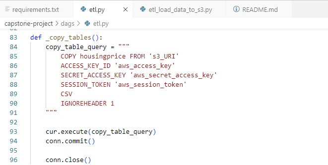

# Capstone Project Construction

For anyone who want to purchase properties in UK or any firms which is looking for investing in properties in UK,  

## problem


## Source

Raw data that I chose for this project is the information of all registered property sales in United Kingdom from Kaggle website. It is available to download [here](https://www.kaggle.com/datasets/hm-land-registry/uk-housing-prices-paid).


## Data Modeling


## Getting Start

### create and activate virtual environment and install tools as provided in requirements file.

```sh
python -m venv ENV
source ENV/bin/activate
pip install -r requirements.txt
```

### make dags directory in Airflow

```sh
mkdir -p ./dags ./logs ./plugins
echo -e "AIRFLOW_UID=$(id -u)" > .env
```

### Run docker-compose 

```sh
docker-compose up
```

### After running prepared docker-compose file, we can access to PySpark and Airflow by following port 8080 and port 8888 respectively.

## Create AWS S3 Bucket

First of all, we need to create the AWS S3 bucket as our "data lake" to collect raw data.

In this step, S3 bucket must be eited "block public access" and bucket policy to allow all access from public can connect to the bucket (note: this edition is not recemmended for practical use).

To get AWS Credential keys for connecting to S3 bucket, we can use code below on the AWS interface as shown in picture to get "aws_access_key", "aws_secret_access_key", "aws_session_token"

```sh
cat ~/.aws/credentials
```


And we can find AWS S3 URI in the S3 properties interface as shown in pictue below


## Loading raw data to Datalake, AWS S3 bucket
To connect to AWS S3 bucket, AWS Credential keys as mentioned above and S3 URI are required in this step. 
Change connection configurations in etl code following by AWS Credential keys and S3 URI.


### run provided etl code to load raw data to AWS s3 Bucket.

```sh
python etl_load_data_to_s3.py
```

Now, our data was uploaded to S3 bucket


## Create AWS Redshift
AWS Redshift will be used as data warehouse for tranfroming raw data from data lake, AWS S3, to another tables that we need in AWS Redshift.

Same as the connection of AWS S3, We must use specific endpoint of Redshift cluster, password, database name, username and port number for connecting to AWS Redshift.


## ETL PySpark-Notebook with S3
Before transforming the data to AWS Redshift, we can run prepared python code that can connect to AWS S3 on PySpark-Notebook to explore, clean and transform our raw data, and also write cleaded data to AWS S3. This step help us to do our tasks more autonomous and clean raw data easier by just running python code.

Connect to PySpark-Notebook by following port 8888


## Creating and Scheduling Data Pipeline with Airflow
Connect to Airflow by following port 8080

Prepare etl code and adjust connection configurations to access to data lake (AWS S3) and data warehouse (AWS Redshift) and etl code in dags folder.




In this project, scheduling data pipeline consists of creating tables in AWS Redshift, loading data from AWS S3 to stagging data in AWS Redshift and then transforming stagging table to provided tables that will be used for Visualization process in the next step.

Provided etl code make our pipeline can run autonomously following by dags operation as show in picture below.


Activate and triggle dag on Airflow interface and now we can see that graph of operator process was created autonomously and all statuses of each process are turned to "success" (green color).


And we can see all tables by was created by scheduling data pipeline on Redshift interface as shown in picture below.


## Data Visualizaion with Tableau
To create data visualization, we can connect tableau with AWS Redshift Directly by usging AWS Redshift endpoint, username, password, port and database name.


we can connect Tableau with AWS Redshift already. Now we can use these tables to build our Visualization.


The Dashboard for this project is shown in picture below.

